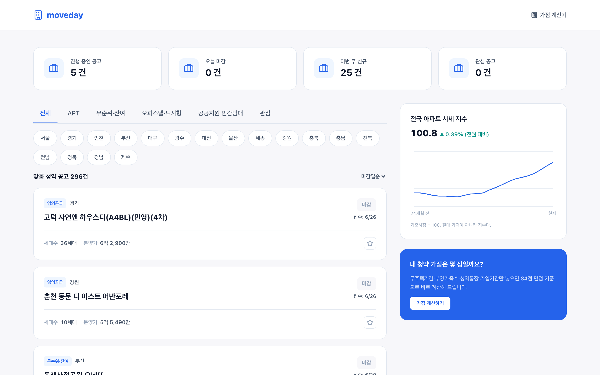
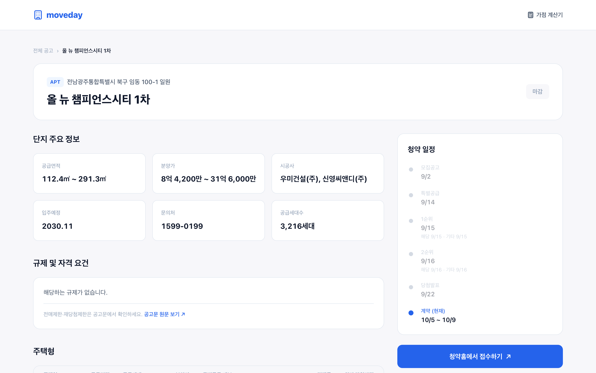
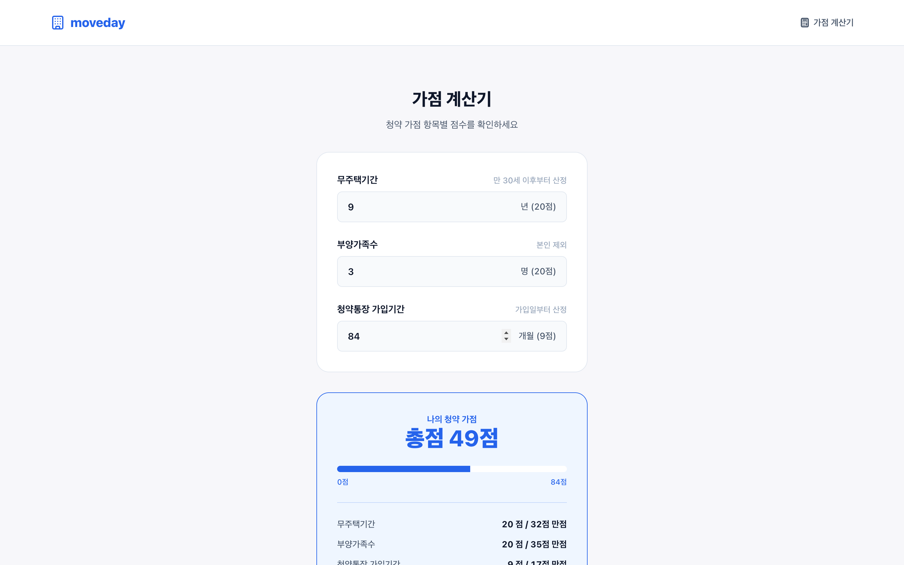

# moveday

아파트 청약 공고를 **"언제 이사 갈 수 있는가"** 관점으로 보여주는 대시보드.

**▶ [moveday-one.vercel.app](https://moveday-one.vercel.app)**

공고 목록과 마감 임박, 주택형별 분양가·경쟁률·당첨가점, 공급위치 지도, 지역 시세 흐름,
청약 가점 계산기를 한 화면에서 다룬다. 데이터는 **한국부동산원 청약홈**(공공데이터포털)과
**R-ONE 부동산통계**에서 실시간으로 가져온다.

| | |
|---|---|
| 스택 | Next.js 15 App Router · TypeScript · Tailwind v4 · TanStack Query · Recharts · Vitest |
| 규모 | 코드 4,500줄 · 테스트 138개 · 설계 문서 2,500줄 |
| 배포 | Vercel |

---

## 화면

### 대시보드
접수중·오늘 마감·신규·관심 요약, 유형 탭과 지역 필터, 공고 카드 목록, 지역 시세 지수.



### 공고 상세
단지 주요 정보, 규제·자격 요건, 주택형별 분양가·경쟁률·최저 당첨가점, 특별공급 접수현황,
공급위치 지도, 지역 시세 3개 지수. 우측에 청약 일정 타임라인.



### 가점 계산기
무주택기간·부양가족수·청약통장 가입기간으로 84점 만점을 계산한다. 값은 브라우저에 저장되고
공고 상세에서 "내 가점 vs 이 주택형 최저 당첨가점"으로 나란히 보인다.



---

## 이 프로젝트의 중심: 정규화 계층

청약홈 API는 주택 유형이 5종인데 **유형마다 필드명·날짜 형식·접수 윈도우 개수가 전부 다르다.**

| | APT | 무순위·잔여 | 오피스텔·도시형 | 공공지원 민간임대 | 임의공급 |
|---|---|---|---|---|---|
| 날짜 형식 | `2026-09-28` | `2026-09-28` | `2026-09-28` | `20260928` | `20260928` |
| 접수 윈도우 | 최대 **8개** | 3개 | 1개 | 1개 | 3개 |
| 주택형 | `HOUSE_TY` | `HOUSE_TY` | `GP`+`TP` | `GP`+`TP` | `HOUSE_TY` |
| 면적 | 공급면적 | 공급면적 | 전용면적 | 전용면적 | **필드 없음** |
| 규제 플래그 | 8종 | 없음 | 없음 | 없음 | 없음 |

같은 "접수 시작일"이 유형에 따라 `SUBSCRPT_RCEPT_BGNDE`이기도 하고
`GNRL_RNK1_CRSPAREA_RCPTDE`이기도 하다. 날짜를 문자열로 비교하면 형식이 섞이는 순간 마감
판정이 조용히 뒤집힌다.

그래서 **raw 필드를 아는 곳은 유형별 어댑터뿐이고, 화면 코드는 raw 필드를 절대 참조하지 않는다.**
어댑터가 공통 `Notice` 타입으로 바꾼 뒤부터 유형 분기가 사라진다. 단위 테스트는 이 계층에만
붙였다 — 날짜·금액 파싱, D-day 계산, 유형·지역 매핑, 표본 응답 감지.

```
app/api/*     Route Handler — 인증키 숨기기 · 프록시 · 캐시 · 정규화만
lib/applyhome/adapters/{apt,remndr,urbty,rent,opt}.ts   ← raw 키를 아는 유일한 곳
lib/rebstat/  R-ONE 클라이언트 + 어댑터
components/   화면 — 공통 타입만 본다
```

---

## 잡아낸 함정

빌드도 통과하고 화면도 멀쩡한데 **값만 틀린** 부류를 찾는 데 대부분의 시간을 썼다.

| 함정 | 증상 | 원인 |
|---|---|---|
| **D-day 서버 타임존** | `TZ=UTC`에서 마감일이 하루 어긋남 | `date-fns`가 서버 로컬 달력을 쓴다 → KST 고정 |
| **`CLS_ID`가 통계표마다 다름** | 서울을 요청하면 부산 데이터 | 같은 `500008`이 매매 표에서는 서울, 실거래 표에서는 부산. 17개 중 16개가 어긋났다 |
| **한 키에 여러 행** | 특별공급이 실제의 1/6, 당첨가점이 0점 | 상류가 주택형별·거주지역별로 여러 행을 주는데 첫 행만 쓰고 있었다 |
| **존재하지 않는 표기** | 조인 키가 6종 충돌 | 문서에 "실측"으로 적힌 `84㎡A`가 웹사이트 렌더링 오기였다. API는 `084.7459A` 한 형태뿐 |
| **에러가 아닌 에러** | 정상 요청이 502 | R-ONE의 `INFO-200`은 "데이터 없음"이지 장애가 아니다. 공표 지연으로 매달 발생 |
| **표본 응답** | 키가 안 먹어도 정상 응답 | R-ONE은 키를 빼면 에러 대신 실제 데이터 5건을 준다 |

찾는 방법도 같이 정리했다.

- **돌연변이 테스트** — 고친 코드를 되돌려 테스트가 실제로 죽는지 본다. 이걸로 "통과했지만 그 코드를 지나지 않는" 테스트를 여러 번 걸러냈다.
- **음성 대조군** — 가짜 키·틀린 지역 코드로 같은 호출을 해서, 검증이 정말 판별하고 있는지 확인한다.
- **독립 오라클** — 우리 API 응답을 상류 원본과 직접 대조한다. 지역 코드 버그는 이걸로 확정했다.

설계 판단과 되돌린 결정은 [`docs/DESIGN.md`](docs/DESIGN.md)에 근거까지 남겼다.

---

## 로컬에서 띄우기

```bash
pnpm install
cp .env.example .env.local
pnpm dev                        # http://localhost:3000
```

**인증키가 없어도 화면 전체를 볼 수 있다.** `.env.local`에 이것만 넣으면 실제 API 응답을
캡처해둔 픽스처 23개로 동작한다. 키를 받기 전까지 이 방식으로 개발했다.

```
MOVEDAY_USE_FIXTURES=1
```

### 환경변수

| 이름 | 발급처 | 없을 때 |
|---|---|---|
| `ODCLOUD_SERVICE_KEY` | [공공데이터포털](https://www.data.go.kr) — **15098547**(분양정보) + **15098905**(경쟁률) 둘 다 활용신청. 키는 계정 공용 | 공고 목록·상세가 503 |
| `REB_STAT_API_KEY` | [R-ONE](https://www.reb.or.kr/r-one/portal/openapi/openApiActKeyPage.do) — 포털이 아니라 R-ONE에서 직접 | 시세 차트만 사라짐 |
| `NEXT_PUBLIC_KAKAO_MAP_KEY` | [Kakao Developers](https://developers.kakao.com) — **JavaScript 키**, Web 플랫폼에 도메인 등록 필요 | 지도 섹션만 사라짐 |

공공데이터포털은 **Decoding 키**를 쓴다. 이 앱은 키를 `Authorization: Infuser {key}` 헤더로
보내므로 URL 인코딩된 Encoding 키를 넣으면 인증이 깨진다.

**서버 키에 `NEXT_PUBLIC_` 접두어를 붙이지 않는다** — 클라이언트 번들에 그대로 실린다.
지도 키만 예외이고, 그건 노출이 정상인 값이라 카카오 콘솔에서 도메인을 제한해 보호한다.

키가 하나 없으면 **그 기능만** 사라지고 나머지는 정상 동작한다.

```bash
pnpm test     # vitest 138개
pnpm lint
pnpm build
```

---

## 문서

| 문서 | 내용 |
|---|---|
| [`docs/DESIGN.md`](docs/DESIGN.md) | 설계 전체. 타입·API 계약·캐시·화면 정의, **흡수한 함정과 근거**, 되돌린 판단 기록 |
| [`docs/API-FIELDS.md`](docs/API-FIELDS.md) | 원본 API 필드 매핑. 실측 확정과 미확인을 구분해 표기 |
| [`docs/DEPLOY.md`](docs/DEPLOY.md) | Vercel 배포 체크리스트, 환경변수 재배포 조건, 장애 진단 |

## 범위 밖

AI 분석, 알림(텔레그램/슬랙), 실거래가 개별 거래 조회, 스케줄 수집·DB 적재.

상세 화면 하단의 `AISection`은 플레이스홀더만 있고, 상세 응답·경쟁률·지역 통계 JSON을 그대로
프롬프트 입력으로 쓸 수 있게 필드를 갖춰뒀다 — 라우트 하나와 그 컴포넌트 내부만 채우면 되고
기존 코드는 고치지 않는다.
